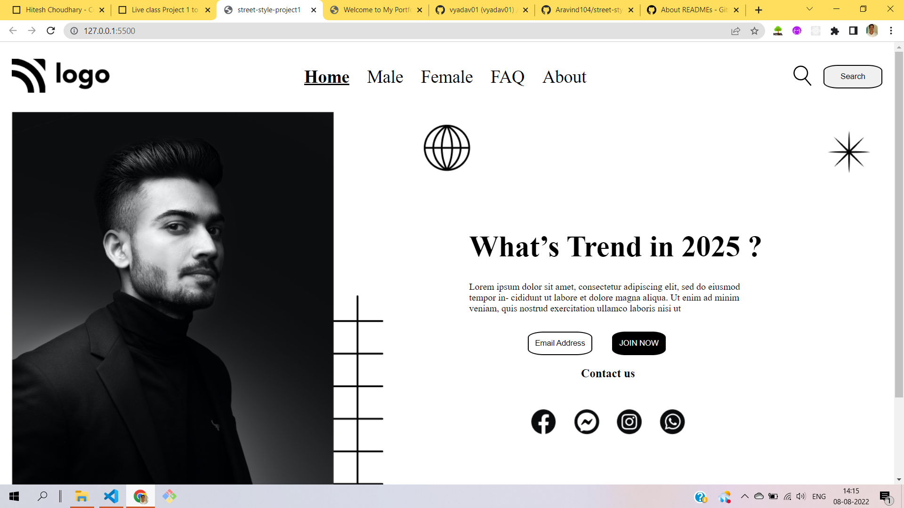

# Hey There I'm Aravind

In this project i implemented basic static website using below `Tech Stack`

- HTML5
- CSS3
  - Flexbox
  - Absolute and Relative position concept

> Here is the glimpse picture of project

Live-link :[street-style](https://street-style-project-01.netlify.app)

